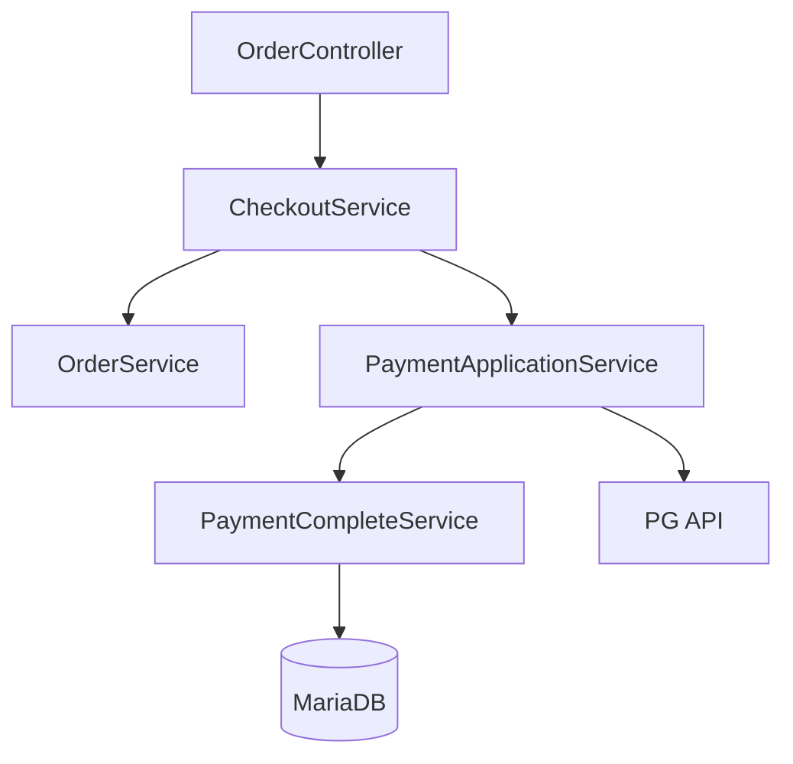
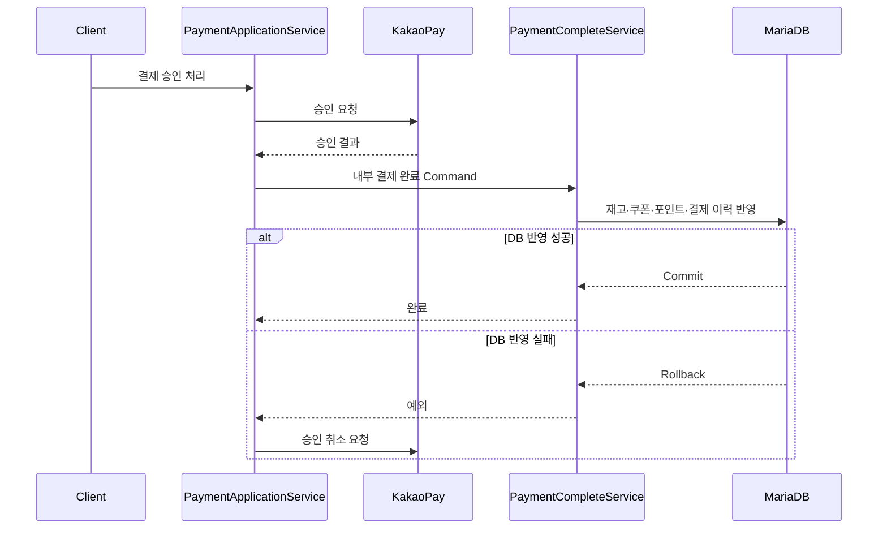

# F&B Commerce Backend API

식음료 커머스의 회원, 상품, 장바구니, 주문, 쿠폰, 포인트 및 PG 결제를 다루는 Spring Boot 기반 REST API입니다.

단순 CRUD 구현보다 **주문 금액 계산과 검증**, **결제 승인과 내부 데이터 반영의 트랜잭션 경계**, **실패 시 PG 승인 취소**를 어떻게 구성할지 실험하는 데 초점을 두었습니다. 주문 생성은 `CheckoutService`가 조정하고, 외부 PG 통신과 내부 결제 완료 처리를 서로 다른 서비스로 분리했습니다.

> 현재 개발 중인 학습용 프로토타입입니다. 실행 및 연동 전 [현재 상태와 제한사항](#현재-상태와-제한사항)을 확인해 주세요.

## 구현 범위

| 영역 | 구현 내용 |
| --- | --- |
| 인증 | 회원가입, BCrypt 비밀번호 암호화, 로그인, JWT 발급 및 Stateless 인증 필터 |
| 상품 | 상품 목록·상세·옵션·이미지 조회, 주문 수량 기준 재고 검증 |
| 장바구니 | 상품과 옵션 추가, 회원별 조회, 수량 변경, 삭제 |
| 쿠폰 | 쿠폰 목록 조회, 회원 쿠폰 발급, 상품 적용 가능 여부 검증 |
| 주문 | 회원·상품·옵션·쿠폰·포인트 검증, 할인 계산, 주문과 주문 상품 저장 |
| 결제 | PG 전략 선택, 카카오페이 Ready·Approve·Cancel 요청, 결제 수단별 이력 저장 |
| 결제 후처리 | 재고 차감·복원, 쿠폰 사용·복원, 포인트 적립·복원, 주문 상태 변경 |
| 마이페이지 | 회원 정보와 주문 내역 조회 |
| 리뷰 | 상품별 리뷰 및 회원별 작성 리뷰 조회 |

## 기술 스택

| 구분 | 기술 |
| --- | --- |
| Language | Java 17 |
| Framework | Spring Boot 3.5.6 |
| Web | Spring MVC, Bean Validation |
| Security | Spring Security, JWT(JJWT 0.11.5), BCrypt |
| Persistence | Spring Data JPA, `EntityManager`, Criteria API |
| Database | MariaDB |
| Build | Gradle Wrapper 8.14.3 |
| Utilities | Lombok |

## 설계 포인트

### 1. 주문 생성 흐름 조정

`CheckoutService`는 주문 생성과 결제 처리를 조정하는 상위 서비스입니다. `OrderService`는 주문 검증·계산·저장을 담당하고, `PaymentApplicationService`는 결제 요청과 승인·취소 흐름을 담당합니다.



이 구조는 주문 도메인이 PG 호출을 직접 책임지지 않고, 상위 유스케이스가 주문과 결제의 실행 순서를 결정하도록 만드는 것을 목표로 합니다.

### 2. 주문 규칙의 객체 분리

- `OrderProcessor`: 주문 구성과 금액 계산 절차를 담당합니다.
- `OrderValidator`: 회원 상태, 보유 포인트, 쿠폰, 상품 및 옵션의 주문 가능 여부를 검증합니다.
- `DiscountPolicy`: 정액 할인과 정률 할인을 동일한 인터페이스로 처리합니다.
- `PointPolicy`: 정액 포인트와 정률 포인트 정책을 캡슐화합니다.
- `PayFactory`와 `IPay`: PG 유형에 따라 카카오·네이버·토스 결제 구현을 선택합니다.

### 3. PG 호출과 DB 트랜잭션 분리

PG 승인 HTTP 호출 중 DB 트랜잭션을 장시간 점유하지 않도록, 외부 승인과 내부 데이터 반영을 분리했습니다.



`PaymentCompleteService.handlePaymentApprove()`는 `@Transactional`로 내부 데이터 변경을 하나의 트랜잭션으로 묶습니다. 예외가 외부로 전달되면 `PaymentApplicationService`가 승인된 PG 거래의 취소를 즉시 시도합니다.

현재 보상 취소는 동기 방식입니다. 프로세스 종료나 PG 취소 실패까지 복구하려면 Outbox 또는 메시지 큐, 영속적인 재시도 작업과 정산 배치가 추가로 필요합니다.

## 프로젝트 구조

```text
src/main/java/com/fnb/front/backend
├── config/                         # Spring Security 및 애플리케이션 설정
├── security/                       # JWT 생성·검증, 인증 필터, UserDetails
├── controller/
│   ├── domain/
│   │   ├── command/                # 서비스 사이의 결제 처리 Command
│   │   ├── implement/              # 할인·포인트·결제 정책 인터페이스
│   │   ├── pay/                    # PG별 결제 구현
│   │   ├── processor/              # 주문·결제 처리 객체
│   │   ├── request/                # API 요청 모델
│   │   ├── response/               # API 응답 모델
│   │   └── validator/              # 주문 유효성 검증
│   └── dto/                        # PG 및 내부 전달 DTO
├── repository/                     # EntityManager·Criteria API 기반 데이터 접근
├── service/
│   ├── CheckoutService             # 주문·결제 유스케이스 조정
│   ├── OrderService                # 주문 생성·조회·상태 변경
│   ├── PaymentApplicationService   # PG 요청·승인·취소 조정
│   └── PaymentCompleteService      # 결제 후 내부 데이터의 트랜잭션 처리
└── util/                           # 상태·유형 Enum 및 공통 유틸리티
```

## API

`/auth/sign-in`, `/auth/sign-up`을 제외한 모든 엔드포인트는 JWT 인증이 필요합니다.

### 인증

| Method | Endpoint | 인증 | 설명 |
| --- | --- | --- | --- |
| `POST` | `/auth/sign-up` | 불필요 | 회원가입 |
| `POST` | `/auth/sign-in` | 불필요 | 로그인 및 JWT 발급 |

### 상품과 장바구니

| Method | Endpoint | 설명 |
| --- | --- | --- |
| `GET` | `/product/list` | 상품 목록 조회 |
| `GET` | `/product/{productId}` | 상품·옵션·이미지 상세 조회 |
| `GET` | `/product/validate/{productId}?quantity={quantity}` | 구매 수량 기준 재고 확인 |
| `POST` | `/cart` | 상품과 선택 옵션을 장바구니에 추가 |
| `GET` | `/cart/{memberId}` | 회원 장바구니 조회 |
| `PUT` | `/cart` | 장바구니 수량 변경 |
| `DELETE` | `/cart/{cartId}` | 장바구니 삭제 |

### 쿠폰과 주문

| Method | Endpoint | 설명 |
| --- | --- | --- |
| `GET` | `/coupon/list` | 사용 가능한 쿠폰 조회 |
| `POST` | `/coupon/{memberId}/{couponId}` | 회원에게 쿠폰 발급 |
| `POST` | `/coupon/valid-apply/{memberId}/{couponId}?productId={productId}` | 회원 쿠폰의 상품 적용 가능 여부 확인 |
| `POST` | `/order` | 주문 생성 및 결제용 주문 정보 반환 |
| `PUT` | `/cancel-order/{orderId}` | 주문 취소 요청 |

### 결제

| Method | Endpoint | 설명 |
| --- | --- | --- |
| `POST` | `/payment/request` | 선택한 PG의 결제 준비 요청 |
| `POST` | `/payment/kakao/approve` | 카카오페이 승인 및 내부 결제 완료 처리 |
| `POST` | `/payment/kakao/cancel` | 카카오페이 취소 결과 반영 |

### 마이페이지와 리뷰

| Method | Endpoint | 설명 |
| --- | --- | --- |
| `GET` | `/my-page/info/{memberId}` | 회원 정보·포인트·쿠폰 요약 조회 |
| `GET` | `/my-page/order` | 회원 주문 내역 검색 및 페이지 조회 |
| `GET` | `/review?productId={productId}` | 상품 리뷰 조회 |
| `GET` | `/review/{memberId}` | 회원이 작성한 리뷰 조회 |

## 실행 방법

### 요구 사항

- JDK 17 이상
- MariaDB
- Gradle 배포 파일과 Maven 의존성을 내려받을 수 있는 네트워크

### 저장소 준비

```bash
git clone https://github.com/leedoohee/fnb-front-backend-api.git
cd fnb-front-backend-api
```

### 데이터베이스 준비

```sql
CREATE DATABASE fnb2
    CHARACTER SET utf8mb4
    COLLATE utf8mb4_unicode_ci;
```

현재 Hibernate 설정은 `ddl-auto=update`입니다. 별도의 Flyway/Liquibase 마이그레이션과 초기 데이터는 아직 제공하지 않습니다.

### 환경 설정

개발 기본값은 `src/main/resources/application.properties`에 있습니다. 로컬 실행 시 DB 접속 정보와 JWT 서명 키를 환경 변수로 덮어쓰는 방식을 권장합니다.

macOS/Linux:

```bash
export SPRING_DATASOURCE_URL='jdbc:mariadb://localhost:3306/fnb2?serverTimezone=UTC&characterEncoding=UTF-8'
export SPRING_DATASOURCE_USERNAME='root'
export SPRING_DATASOURCE_PASSWORD='your-password'
export JWT_SECRET="$(openssl rand -base64 32)"
export JWT_EXPIRATION_TIME='86400'
```

Windows PowerShell:

```powershell
$env:SPRING_DATASOURCE_URL = 'jdbc:mariadb://localhost:3306/fnb2?serverTimezone=UTC&characterEncoding=UTF-8'
$env:SPRING_DATASOURCE_USERNAME = 'root'
$env:SPRING_DATASOURCE_PASSWORD = 'your-password'
$env:JWT_SECRET = '<Base64로 인코딩한 256비트 이상의 키>'
$env:JWT_EXPIRATION_TIME = '86400'
```

`JWT_EXPIRATION_TIME`은 초 단위입니다. 실제 PG 연동 시 카카오페이 Secret Key와 CID, 성공·실패·취소 URL도 외부 설정으로 분리해야 합니다.

### 실행

macOS/Linux:

```bash
./gradlew bootRun
```

Windows:

```bat
gradlew.bat bootRun
```

기본 주소는 `http://localhost:8080`입니다.

## 인증 예시

### 회원가입

```bash
curl -X POST 'http://localhost:8080/auth/sign-up' \
  -H 'Content-Type: application/json' \
  -d '{
    "memberId": "demo-user",
    "name": "Demo User",
    "password": "change-me",
    "email": "demo@example.com",
    "phone": "010-0000-0000",
    "address": "Seoul"
  }'
```

### 로그인 및 인증 API 호출

로그인 응답 본문으로 JWT 문자열을 반환합니다.

```bash
TOKEN=$(curl -s -X POST 'http://localhost:8080/auth/sign-in' \
  -H 'Content-Type: application/json' \
  -d '{"memberId":"demo-user","password":"change-me"}')

curl 'http://localhost:8080/product/list' \
  -H "Authorization: Bearer ${TOKEN}"
```

## 주문 요청 예시

```json
{
  "memberId": "demo-user",
  "orderType": 1,
  "point": 1000,
  "orderProductRequests": [
    {
      "productId": 1,
      "productOptionIds": [10, 11],
      "quantity": 2
    }
  ],
  "orderCouponRequests": [
    {
      "productId": 1,
      "couponId": 3
    }
  ]
}
```

## 현재 상태와 제한사항

이 저장소는 핵심 도메인과 결제 흐름을 구현하는 단계이며, 운영 환경에서 사용하려면 다음 항목을 보완해야 합니다.

- `CheckoutService`가 주문·결제 진입점을 조정하도록 추가됐지만, `OrderService`에 남아 있는 `PaymentApplicationService` 의존으로 직접 순환참조가 아직 완전히 제거되지 않았습니다.
- `*Command` 클래스가 현재 `ApplicationEvent`를 상속하면서 직접 메서드 인자로 사용됩니다. 일반 Command 객체로 변경하고 `source` 의존을 제거해야 합니다.
- 주문 생성 후 결제 분기 조건과 `isNonPayment` 의미가 이름 및 주석과 일치하지 않아 0원 결제와 일반 PG 결제 흐름을 분리해야 합니다.
- 카카오페이 취소 URL과 취소 면세 금액 매핑을 실제 API 명세에 맞게 수정해야 합니다.
- 결제 승인 후 DB 반영 실패 시 동기 취소를 시도하지만, 취소 실패를 저장하고 재처리하는 영속적인 보상 작업은 없습니다.
- 결제 승인 금액과 서버 주문 금액의 대조, 중복 승인·취소 방지를 위한 멱등성 키와 동시성 제어가 필요합니다.
- 네이버페이와 토스페이 구현은 현재 메서드 골격만 존재합니다.
- URL의 `memberId`와 인증된 사용자의 소유권을 대조하지 않아 리소스 단위 인가를 추가해야 합니다.
- DB 비밀번호, JWT 키, PG 키 및 콜백 URL을 환경 변수나 Secret Manager로 완전히 외부화해야 합니다.
- 전역 예외 응답, CORS 정책, API 명세(OpenAPI), DB 마이그레이션, 테스트 코드와 CI가 아직 없습니다.

## 개선 계획

1. `OrderService → PaymentApplicationService` 의존을 제거해 `CheckoutService`를 단일 주문·결제 조정자로 확정합니다.
2. 결제 Command에서 `ApplicationEvent` 상속을 제거하고 승인·취소 입력 모델을 불변 객체로 정리합니다.
3. PG 승인 금액 검증과 결제 멱등성, 재고 차감 동시성 제어를 추가합니다.
4. 취소 실패 작업을 영속화하고 재시도·정산 배치로 승인/주문 불일치를 복구합니다.
5. Testcontainers 기반 결제 통합 테스트와 애플리케이션 컨텍스트 기동 테스트를 추가합니다.
6. Flyway 마이그레이션, OpenAPI 문서, CI 파이프라인을 구성합니다.
