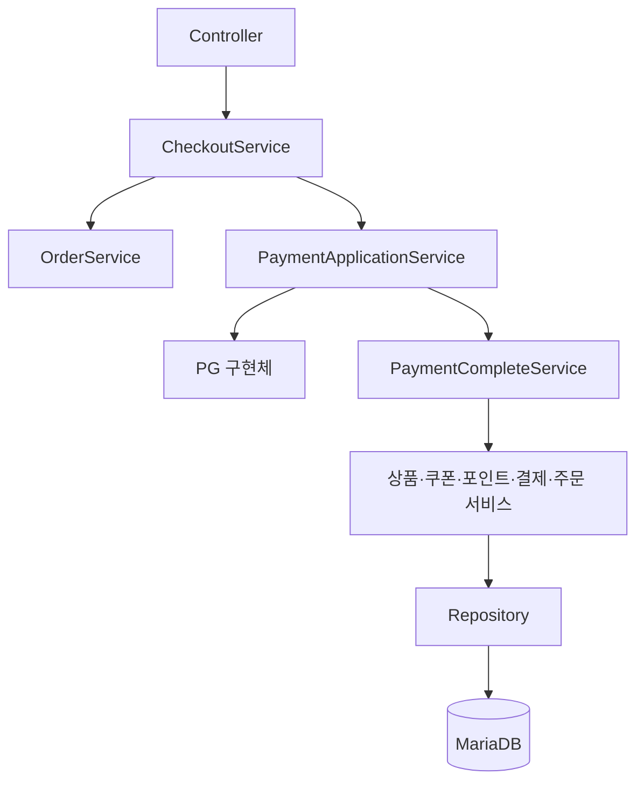
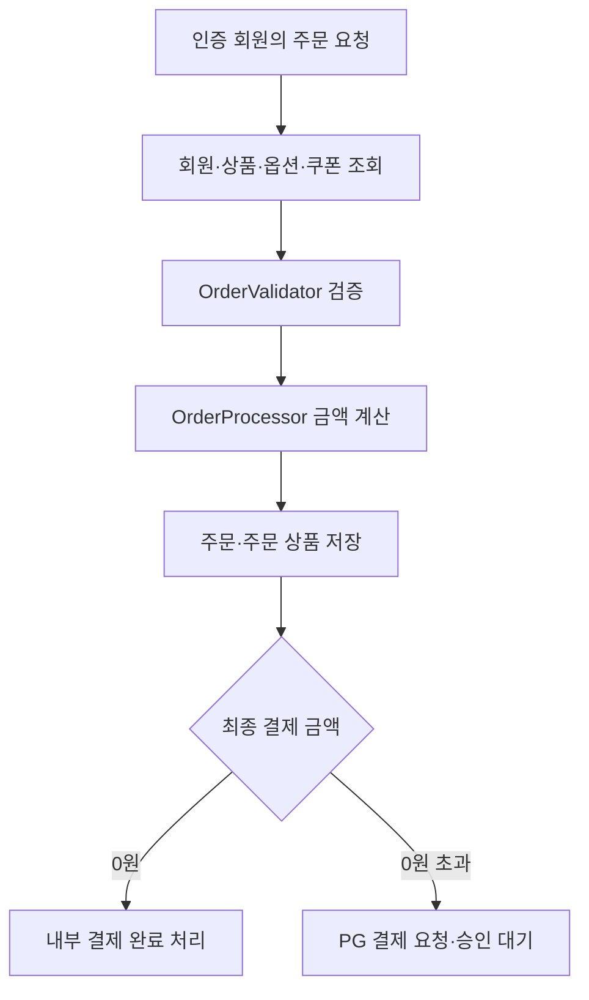
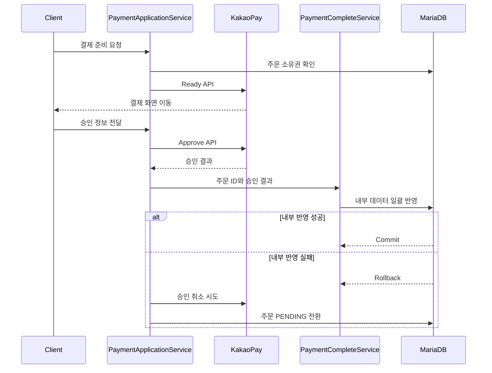

# F&B Commerce Backend API

식음료 커머스의 회원, 상품, 장바구니, 쿠폰, 주문, 포인트와 PG 결제를 다루는 Spring Boot REST API입니다.

주문 검증·금액 계산을 도메인 객체로 분리하고, 외부 PG 통신과 내부 결제 완료 처리를 서로 다른 트랜잭션 경계로 구성했습니다. 주문·결제 유스케이스는 `CheckoutService`와 `PaymentApplicationService`가 조정하며, 결제 승인 후 내부 반영에 실패하면 DB 작업을 롤백하고 PG 승인 취소를 시도합니다.

> 현재 개발 중인 프로젝트입니다. 운영 환경에 적용하기 전에 [현재 상태와 보완 과제](#현재-상태와-보완-과제)를 확인해 주세요.

## 주요 기능

| 영역 | 구현 내용 |
| --- | --- |
| 인증 | 회원가입, BCrypt 비밀번호 암호화, 로그인, JWT 발급 및 Stateless 인증 |
| 회원 인가 | 인증 회원 기준 주문 생성·취소, 결제 준비, 쿠폰 발급·검증, 일부 개인 리소스 조회·삭제 |
| 상품 | 판매 상품 목록·상세·옵션·이미지 조회, 주문 수량 검증 |
| 장바구니 | 상품·옵션 추가, 인증 회원 장바구니 조회, 수량 변경, 소유 조건 삭제 |
| 쿠폰 | 사용 가능 쿠폰 조회, 인증 회원 쿠폰 발급, 기간·등급·대상 상품 검증, 사용·복원 |
| 주문 | 회원·상품·옵션·쿠폰·포인트 검증, 할인 계산, 주문 및 주문 상품 저장 |
| 결제 | 결제 전략 선택, 카카오페이 Ready·Approve·Cancel 호출 |
| 결제 후처리 | 재고·쿠폰·포인트·결제 이력·주문 상태를 하나의 DB 트랜잭션에서 반영 |
| 마이페이지 | 인증 회원 정보와 주문 내역 조회 |
| 리뷰 | 상품별 리뷰 및 인증 회원이 작성한 리뷰 조회 |

## 기술 스택

| 구분 | 기술 |
| --- | --- |
| Language | Java 17 |
| Framework | Spring Boot 3.5.6 |
| Web | Spring MVC, Bean Validation |
| Security | Spring Security, JWT(JJWT 0.11.5), BCrypt |
| Persistence | JPA, `EntityManager`, Criteria API |
| Database | MariaDB |
| Build | Gradle Wrapper 8.14.3 |
| Utilities | Lombok |

## 아키텍처



### 서비스 책임

| 구성요소 | 책임 |
| --- | --- |
| `CheckoutService` | 주문 생성·취소 유스케이스 진입점, 0원 주문의 내부 결제 완료 처리 연결 |
| `OrderService` | 주문 대상 조회, 주문 검증·계산·저장, 회원 소유 주문 조회, 주문 상태 변경 |
| `PaymentApplicationService` | PG 요청·승인·취소와 내부 처리 순서 조정, 실패 보상 호출 |
| `PaymentCompleteService` | 트랜잭션 안에서 주문·결제 Aggregate를 다시 조회하고 내부 데이터를 일괄 반영 |
| `OrderProcessor` | 주문 상품 구성과 상품·옵션·쿠폰·회원 등급 할인 계산 |
| `OrderValidator` | 회원, 포인트, 쿠폰, 상품, 옵션, 주문 수량 검증 |

`CheckoutService`가 주문과 결제 애플리케이션 서비스를 조정하므로 `OrderService`와 `PaymentApplicationService`가 서로 호출하는 순환 참조를 만들지 않습니다. 결제 Command에는 JPA 엔티티 대신 주문·결제 식별자를 전달하고, `PaymentCompleteService`가 자신의 트랜잭션 안에서 필요한 데이터를 다시 조회합니다.

## 인증과 리소스 인가

JWT 필터가 토큰의 회원 ID로 `CustomUserDetails`를 구성합니다. 개인 리소스 일부는 요청에서 `memberId`를 받지 않고 `@AuthenticationPrincipal`의 `getUserId()`를 사용합니다.

```java
@GetMapping("/cart")
public ResponseEntity<List<CartInfoResponse>> getCart(
        @AuthenticationPrincipal CustomUserDetails user
) {
    return ResponseEntity.ok(
            cartService.getInfo(user.getUserId())
    );
}
```

간접 식별자로 리소스를 변경할 때는 식별자와 인증 회원 ID를 함께 조회 조건으로 사용합니다. 예를 들어 장바구니 삭제는 `cartId`와 `memberId`가 모두 일치하는 행만 삭제하고, 영향 행 수가 `0`이면 요청을 거절합니다.

| 적용 영역 | 현재 방식 |
| --- | --- |
| 주문 생성 | 요청 Body의 `memberId`를 제거하고 인증 회원 ID 사용 |
| 주문 취소 | `orderId + memberId`로 소유 주문을 먼저 조회 |
| 결제 준비 | `orderId + memberId`로 결제 가능한 주문인지 확인 |
| 장바구니 조회·삭제 | 인증 회원 ID로 조회, `cartId + memberId` 조건으로 삭제 |
| 쿠폰 발급·적용 검증 | URL의 `memberId`를 제거하고 인증 회원 ID 사용 |
| 내 정보·내 리뷰 | 인증 회원 ID 사용 |

인가가 아직 모든 변경 API에 적용된 것은 아닙니다. 남은 범위는 [현재 상태와 보완 과제](#현재-상태와-보완-과제)에 별도로 정리했습니다.

## 주문 처리 흐름



주문 금액은 상품 기본 가격과 옵션 금액에 주문 수량을 적용한 뒤 쿠폰 할인, 회원 등급 할인, 사용 포인트를 차감해 계산합니다. 주문 생성은 `OrderService.create()`의 트랜잭션에서 주문과 주문 상품을 함께 저장합니다.

## 결제 승인과 트랜잭션

PG HTTP 호출이 진행되는 동안 DB 트랜잭션을 점유하지 않도록 외부 승인과 내부 반영을 분리했습니다.



### 트랜잭션 경계

| 단계 | 트랜잭션 | 처리 내용 |
| --- | --- | --- |
| PG Ready·Approve·Cancel | DB 트랜잭션 밖 | 외부 HTTP 요청 |
| 주문 생성 | `OrderService.create()` | 주문과 주문 상품 저장 |
| 결제 승인 내부 반영 | `PaymentCompleteService.handlePaymentApprove()` | 재고 차감, 쿠폰 사용, 포인트 이력, 결제 이력, 주문 상태 변경 |
| 결제 취소 내부 반영 | `PaymentCompleteService.handlePaymentCancel()` | 포인트·재고·쿠폰 복원, 취소 이력, 주문 상태 변경 |

결제 완료·취소 Command는 식별자만 전달합니다. 내부 반영 메서드는 트랜잭션을 시작한 뒤 주문과 결제 데이터를 다시 조회하므로 하위 Repository 변경도 같은 트랜잭션에 참여합니다.

### 카카오페이 승인 URL

현재 승인 API는 JSON Body를 받는 `POST /payment/kakao/approve`로 구현돼 있으며 모든 비인증 API 외에는 JWT를 요구합니다. 반면 카카오페이 Ready 요청의 승인·실패·취소 URL은 아직 개발자 사이트 주소로 고정돼 있습니다.

실제 PG 리다이렉트 방식으로 연결하려면 Ready 응답의 `tid`와 주문 ID, 회원 ID, 서버 계산 금액, 일회용 `state`를 저장해야 합니다. 승인 URL에서는 사용자 Principal을 직접 비교하기보다 저장된 결제 시도와 `pg_token`을 대조하고 한 번만 처리해야 합니다.

## 재고 차감

재고 차감 UPDATE는 상품 ID와 잔여 재고 조건을 함께 사용합니다.

```sql
UPDATE product
SET quantity = quantity - :orderQuantity
WHERE product_id = :productId
  AND quantity >= :orderQuantity;
```

동시 주문으로 재고가 음수가 되는 것을 방지하기 위한 조건입니다. 다만 현재는 UPDATE 영향 행 수를 검사하지 않으므로, 영향 행 수가 `0`일 때 품절 예외를 발생시키는 처리가 추가로 필요합니다.

## 적용한 설계 요소

- `DiscountPolicy`: 정액(`AbsoluteDiscount`)과 정률(`RateDiscount`) 할인 계산을 캡슐화합니다.
- `PointPolicy`: 정액(`AbsolutePoint`)과 정률(`RatePoint`) 적립 계산을 캡슐화합니다.
- `IPay`: PG 요청·승인·취소의 공통 계약을 정의합니다.
- `PayFactory`: 결제 유형에 따라 카카오·네이버·토스 구현체를 선택합니다.
- Command 객체: 결제 단계의 입력을 서비스 호출 단위로 전달하며 엔티티 대신 식별자를 사용합니다.
- 조건부 UPDATE: 상품 ID와 가용 재고 조건을 묶어 원자적으로 재고를 차감합니다.
- 애플리케이션 조정 서비스: 주문·결제 유스케이스를 조정해 서비스 간 순환 참조를 제거합니다.
- 리소스 소유 조건: 직접 입력받은 회원 ID 대신 인증 회원 ID를 사용하고 일부 변경 쿼리에 소유자 조건을 포함합니다.

## 프로젝트 구조

```text
src/main/java/com/fnb/front/backend
├── config/                         # Spring Security 및 애플리케이션 설정
├── security/                       # JWT 생성·검증, 인증 필터, UserDetails
├── controller/
│   ├── domain/
│   │   ├── command/                # 결제 처리 Command
│   │   ├── implement/              # 할인·포인트·결제 정책 인터페이스
│   │   ├── pay/                    # PG별 결제 구현체
│   │   ├── processor/              # 주문·결제 처리 객체
│   │   ├── request/                # API 요청 모델
│   │   ├── response/               # API 응답 모델
│   │   └── validator/              # 주문 검증
│   └── dto/                        # PG 및 내부 전달 DTO
├── repository/                     # EntityManager·Criteria API 기반 데이터 접근
├── service/
│   ├── CheckoutService             # 주문·결제 유스케이스 조정
│   ├── OrderService                # 주문 생성·조회·상태 변경
│   ├── PaymentApplicationService   # PG 호출, 인가 확인과 보상 흐름 조정
│   └── PaymentCompleteService      # 결제 후 내부 반영 트랜잭션
└── util/                           # 상태·유형 Enum 및 공통 유틸리티
```

## API

현재 `/auth/sign-in`, `/auth/sign-up`을 제외한 모든 엔드포인트는 JWT 인증이 필요합니다.

### 인증

| Method | Endpoint | 인증 | 설명 |
| --- | --- | --- | --- |
| `POST` | `/auth/sign-up` | 불필요 | 회원가입 |
| `POST` | `/auth/sign-in` | 불필요 | 로그인 및 JWT 문자열 반환 |

### 상품과 장바구니

| Method | Endpoint | 설명 |
| --- | --- | --- |
| `GET` | `/product/list` | 판매 상품 목록 조회 |
| `GET` | `/product/{productId}` | 상품·옵션·이미지 상세 조회 |
| `GET` | `/product/validate/{productId}?quantity={quantity}` | 주문 수량 기준 상품 검증 |
| `POST` | `/cart` | 상품과 선택 옵션을 장바구니에 추가 |
| `GET` | `/cart` | 인증 회원의 장바구니 조회 |
| `PUT` | `/cart` | 장바구니 수량 변경 |
| `DELETE` | `/cart/{cartId}` | 인증 회원 소유 장바구니 삭제 |

### 쿠폰과 주문

| Method | Endpoint | 설명 |
| --- | --- | --- |
| `GET` | `/coupon/list` | 현재 사용 가능한 쿠폰 조회 |
| `POST` | `/coupon/{couponId}` | 인증 회원에게 쿠폰 발급 |
| `POST` | `/coupon/valid-apply/{couponId}?productId={productId}` | 인증 회원 쿠폰의 상품 적용 가능 여부 확인 |
| `POST` | `/order` | 인증 회원 주문 생성 및 결제용 주문 정보 반환 |
| `PUT` | `/cancel-order/{orderId}` | 인증 회원 소유 주문 취소 요청 |

### 결제

| Method | Endpoint | 설명 |
| --- | --- | --- |
| `POST` | `/payment/request` | 소유 주문 확인 후 선택한 PG의 결제 준비 요청 |
| `POST` | `/payment/kakao/approve` | 카카오페이 승인 및 내부 결제 완료 처리 |
| `POST` | `/payment/kakao/cancel` | 카카오페이 취소 결과의 내부 반영 |

### 마이페이지와 리뷰

| Method | Endpoint | 설명 |
| --- | --- | --- |
| `GET` | `/my-page/info` | 인증 회원 정보·포인트·쿠폰 요약 조회 |
| `GET` | `/my-page/order` | 주문 내역 검색 및 페이지 조회 |
| `GET` | `/product-review/list?productId={productId}` | 상품 리뷰 조회 |
| `GET` | `/my-review/list` | 인증 회원이 작성한 리뷰 조회 |

## 실행 방법

### 요구 사항

- JDK 17 이상
- MariaDB
- Gradle 및 Maven 의존성을 내려받을 수 있는 네트워크

### 저장소와 데이터베이스 준비

```bash
git clone https://github.com/leedoohee/fnb-front-backend-api.git
cd fnb-front-backend-api
```

```sql
CREATE DATABASE fnb2
    CHARACTER SET utf8mb4
    COLLATE utf8mb4_unicode_ci;
```

현재 Hibernate 설정은 `ddl-auto=update`입니다. 별도의 마이그레이션과 초기 데이터는 제공하지 않습니다.

### 환경 변수

저장소의 개발 기본값 대신 DB 접속 정보와 JWT 키를 환경 변수로 전달하는 것을 권장합니다.

macOS/Linux:

```bash
export SPRING_DATASOURCE_URL='jdbc:mariadb://localhost:3306/fnb2?serverTimezone=UTC&characterEncoding=UTF-8'
export SPRING_DATASOURCE_USERNAME='root'
export SPRING_DATASOURCE_PASSWORD='your-password'
export JWT_SECRET="$(openssl rand -base64 32)"
export JWT_EXPIRATION_TIME='86400'
```

Windows PowerShell:

```powershell
$env:SPRING_DATASOURCE_URL = 'jdbc:mariadb://localhost:3306/fnb2?serverTimezone=UTC&characterEncoding=UTF-8'
$env:SPRING_DATASOURCE_USERNAME = 'root'
$env:SPRING_DATASOURCE_PASSWORD = 'your-password'
$env:JWT_SECRET = '<Base64로 인코딩한 256비트 이상의 키>'
$env:JWT_EXPIRATION_TIME = '86400'
```

`JWT_EXPIRATION_TIME`은 현재 구현에서 초 단위로 해석됩니다. 실제 PG 연동 시 카카오페이 Secret Key, CID, 승인·실패·취소 URL도 설정으로 외부화해야 합니다.

### 실행

macOS/Linux:

```bash
./gradlew bootRun
```

Windows:

```bat
gradlew.bat bootRun
```

기본 주소는 `http://localhost:8080`입니다.

## 인증 예시

회원가입:

```bash
curl -X POST 'http://localhost:8080/auth/sign-up' \
  -H 'Content-Type: application/json' \
  -d '{
    "memberId": "demo-user",
    "name": "Demo User",
    "password": "change-me",
    "email": "demo@example.com",
    "phone": "010-0000-0000",
    "address": "Seoul"
  }'
```

로그인 후 내 장바구니 조회:

```bash
TOKEN=$(curl -s -X POST 'http://localhost:8080/auth/sign-in' \
  -H 'Content-Type: application/json' \
  -d '{"memberId":"demo-user","password":"change-me"}')

curl 'http://localhost:8080/cart' \
  -H "Authorization: Bearer ${TOKEN}"
```

## 주문 요청 예시

`memberId`는 JWT 인증 주체에서 가져오므로 요청 Body에 포함하지 않습니다.

```json
{
  "orderType": 1,
  "point": 1000,
  "orderProductRequests": [
    {
      "productId": 1,
      "productOptionIds": [10, 11],
      "quantity": 2
    }
  ],
  "orderCouponRequests": [
    {
      "productId": 1,
      "couponId": 3
    }
  ]
}
```

## 현재 상태와 보완 과제

현재 구현은 결제 완료·취소의 내부 DB 변경을 각각 하나의 트랜잭션으로 묶고, 결제 Command를 ID 기반으로 변경했으며, 주문·쿠폰·일부 개인 리소스에 인증 회원 기반 인가를 적용한 상태입니다. 운영 수준으로 가기 위해 다음 작업이 필요합니다.

- `/payment/request`는 주문 소유권을 확인하지만 회원명·상품명·결제금액·세금 값을 요청 Body에서 그대로 PG에 전달합니다. 주문 조회 결과로 PG 요청을 서버에서 다시 구성해야 합니다.
- 카카오페이 Ready 응답의 `tid`를 주문·회원·예상 금액과 함께 저장하지 않으며 승인·실패·취소 URL도 실제 서비스로 연결돼 있지 않습니다. 승인 콜백은 Principal 대신 저장된 결제 시도, 일회용 `state`, `pg_token`으로 검증해야 합니다.
- 중복 승인·취소에 대해 기존 처리 결과를 반환하는 요청 수준의 멱등성이 없습니다. `orderId` 유일 제약은 중복 저장의 최종 방어선일 뿐 정상적인 재처리는 제공하지 않습니다.
- PG 취소 실패 결과를 영속화하지 않아 프로세스 종료나 네트워크 장애 이후 자동 복구할 수 없습니다. 취소 작업 테이블, 재시도 스케줄러 또는 메시지 큐와 정산 배치가 필요합니다.
- `PaymentElement`의 쿠폰·포인트 및 취소 상세 저장 시 일부 `nullable = false` 필드가 채워지지 않습니다. 결제수단별 필수 컬럼과 승인·취소 이력 관계를 정리해야 합니다.
- 일부 입력 검증이 비활성화될 수 있는 Java `assert`에 의존하고, 표준 오류 응답이 없어 예외별 HTTP 상태가 일관되지 않습니다.
- 네이버페이와 토스페이는 `IPay` 구현 골격만 있고 실제 연동은 구현되지 않았습니다.
- DB 비밀번호와 JWT 키가 설정 파일에 포함되어 있고 카카오페이 키·URL이 코드에 고정되어 있습니다. 운영 비밀값은 환경 변수 또는 Secret Manager로 분리해야 합니다.
- CORS 정책, OpenAPI, DB 마이그레이션, 자동화 테스트와 CI가 아직 없습니다.

## 개선 우선순위

1. 장바구니 등록·수정과 마이페이지 주문 조회에 인증 회원 소유권 조건을 적용합니다.
2. 결제 준비 요청을 서버 주문 데이터로 재구성하고 승인 금액 비교를 정확한 일치 검사로 수정합니다.
3. Ready 단계의 결제 시도를 저장하고 승인 리다이렉트 검증, 상태 전이와 멱등성을 구현합니다.
4. PG 취소 실패를 영속화하고 재시도 및 정산 배치로 PG와 내부 주문 상태의 불일치를 복구합니다.
5. 동시 재고 차감의 영향 행 수 검증과 결제·포인트 이력 모델을 보완합니다.
6. 주문 생성, 0원 결제, 승인 성공, DB 실패 후 PG 취소, 취소 실패 재시도, 중복 승인, 동시 재고 차감 통합 테스트를 작성합니다.
7. PG 구현을 Spring Bean 기반 Gateway로 전환하고 설정과 HTTP Client를 주입합니다.
8. Flyway, OpenAPI, 표준 오류 응답, CI 및 보안 설정을 정리합니다.
