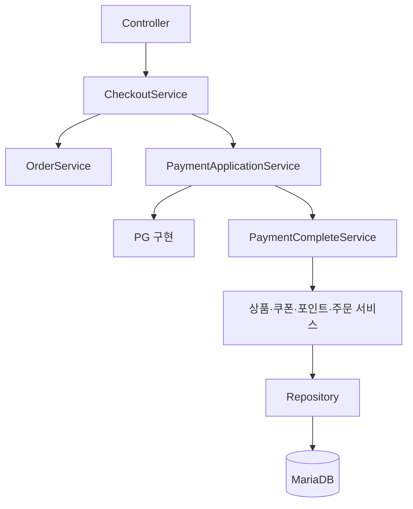
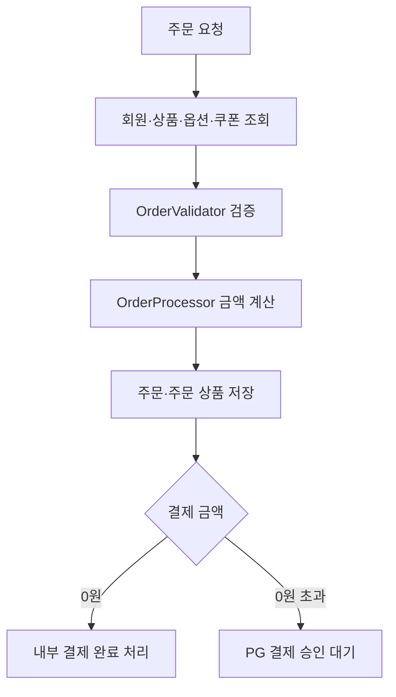
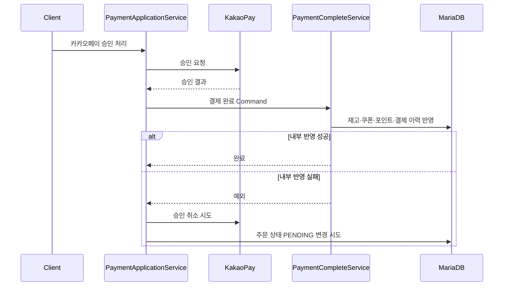

# F&B Commerce Backend API

식음료 커머스의 회원, 상품, 장바구니, 주문, 쿠폰, 포인트, PG 결제를 다루는 Spring Boot REST API입니다.

**주문 조건 검증과 금액 계산**, **PG 승인과 내부 데이터 반영의 분리**, **실패 시 승인 취소**를 주요 설계 과제로 삼았습니다. 주문과 결제의 진입 흐름은 `CheckoutService`가 조정하고, 외부 PG 통신과 결제 후 내부 반영을 별도 서비스로 구분했습니다.

> 현재 개발 중인 프로토타입입니다. 운영 적용 전 [현재 상태와 보완 과제](#현재-상태와-보완-과제)를 확인해 주세요.

## 주요 기능

| 영역 | 구현 내용 |
| --- | --- |
| 인증 | 회원가입, BCrypt 비밀번호 암호화, 로그인, JWT 발급 및 Stateless 인증 |
| 상품 | 상품 목록·상세·옵션·이미지 조회, 주문 수량과 재고 검증 |
| 장바구니 | 상품·옵션 추가, 회원별 조회, 수량 변경, 삭제 |
| 쿠폰 | 쿠폰 조회·발급, 보유 여부·사용 기간·적용 상품 검증, 사용·복원 |
| 주문 | 회원·상품·옵션·쿠폰·포인트 검증, 할인 계산, 주문 및 주문 상품 저장 |
| 결제 | PG 전략 선택, 카카오페이 Ready·Approve·Cancel 연동 |
| 결제 후처리 | 재고 차감·복원, 쿠폰 사용·복원, 포인트 사용·적립·복원, 결제 이력 저장 |
| 마이페이지 | 회원 정보와 주문 내역 조회 |
| 리뷰 | 상품별 리뷰 및 회원별 작성 리뷰 조회 |

## 기술 스택

| 구분 | 기술 |
| --- | --- |
| Language | Java 17 |
| Framework | Spring Boot 3.5.6 |
| Web | Spring MVC, Bean Validation |
| Security | Spring Security, JWT(JJWT 0.11.5), BCrypt |
| Persistence | JPA, `EntityManager`, Criteria API |
| Database | MariaDB |
| Build | Gradle Wrapper 8.14.3 |
| Utilities | Lombok |

## 아키텍처



### 서비스 책임

| 구성요소 | 책임 |
| --- | --- |
| `CheckoutService` | 주문 생성 이후 0원 주문과 일반 PG 결제 흐름 분기, 주문 취소 진입점 제공 |
| `OrderService` | 주문 대상 조회, 주문 검증·계산·저장, 주문 상태 변경 |
| `PaymentApplicationService` | PG 요청·승인·취소 호출과 내부 결제 처리 순서 조정 |
| `PaymentCompleteService` | 재고·쿠폰·포인트·결제 이력·주문 상태의 내부 반영 순서 조정 |
| `OrderProcessor` | 주문 상품 구성과 원가·옵션·쿠폰·회원 등급 할인 계산 |
| `OrderValidator` | 회원, 포인트, 쿠폰, 상품, 옵션, 주문 수량 검증 |

## 주문 처리 흐름



주문 금액은 상품과 기본 옵션 금액에 수량을 적용한 뒤 쿠폰·회원 등급 할인과 사용 포인트를 차감해 계산합니다. 재고 수량과 고객 주문 수량은 분리해 검증과 주문 상품 생성에 각각 사용합니다.

## 결제 승인과 실패 보상

PG HTTP 호출 중 DB 트랜잭션을 오래 점유하지 않도록 외부 승인과 내부 데이터 반영을 서로 다른 단계로 분리했습니다.



현재 구현은 내부 반영 실패를 상위 서비스로 전달하고 PG 승인을 동기 취소하는 보상 흐름을 포함합니다. 다만 여러 DB 변경의 원자성과 취소 실패 복구는 아직 보완이 필요합니다.

## 적용한 설계 요소

- `DiscountPolicy`: 정액(`AbsoluteDiscount`)과 정률(`RateDiscount`) 할인 정책을 캡슐화합니다.
- `PointPolicy`: 정액(`AbsolutePoint`)과 정률(`RatePoint`) 포인트 정책을 캡슐화합니다.
- `IPay`: PG 요청·승인·취소의 공통 계약을 정의합니다.
- `PayFactory`: 입력된 결제 유형에 따라 카카오·네이버·토스 구현을 선택합니다.
- Command 객체: 결제 요청·승인·취소 단계의 입력값을 서비스 호출 단위로 전달합니다.
- 조건부 재고 차감: 재고 부족을 UPDATE 시점에도 확인하는 방식을 적용 중입니다.

## 프로젝트 구조

```text
src/main/java/com/fnb/front/backend
├── config/                         # Spring Security 및 애플리케이션 설정
├── security/                       # JWT 생성·검증, 인증 필터, UserDetails
├── controller/
│   ├── domain/
│   │   ├── command/                # 결제 처리 Command
│   │   ├── implement/              # 할인·포인트·결제 정책 인터페이스
│   │   ├── pay/                    # PG별 결제 구현
│   │   ├── processor/              # 주문·결제 처리 객체
│   │   ├── request/                # API 요청 모델
│   │   ├── response/               # API 응답 모델
│   │   └── validator/              # 주문 검증
│   └── dto/                        # PG 및 내부 전달 DTO
├── repository/                     # EntityManager·Criteria API 기반 데이터 접근
├── service/
│   ├── CheckoutService             # 주문·결제 유스케이스 조정
│   ├── OrderService                # 주문 생성·조회·상태 변경
│   ├── PaymentApplicationService   # PG 승인·취소 및 보상 흐름 조정
│   └── PaymentCompleteService      # 결제 후 내부 데이터 반영 조정
└── util/                           # 상태·유형 Enum 및 공통 유틸리티
```

## API

`/auth/sign-in`, `/auth/sign-up`을 제외한 모든 엔드포인트는 JWT 인증이 필요합니다.

### 인증

| Method | Endpoint | 인증 | 설명 |
| --- | --- | --- | --- |
| `POST` | `/auth/sign-up` | 불필요 | 회원가입 |
| `POST` | `/auth/sign-in` | 불필요 | 로그인 및 JWT 발급 |

### 상품과 장바구니

| Method | Endpoint | 설명 |
| --- | --- | --- |
| `GET` | `/product/list` | 상품 목록 조회 |
| `GET` | `/product/{productId}` | 상품·옵션·이미지 상세 조회 |
| `GET` | `/product/validate/{productId}?quantity={quantity}` | 주문 수량 기준 상품 검증 |
| `POST` | `/cart` | 상품과 선택 옵션을 장바구니에 추가 |
| `GET` | `/cart/{memberId}` | 회원 장바구니 조회 |
| `PUT` | `/cart` | 장바구니 수량 변경 |
| `DELETE` | `/cart/{cartId}` | 장바구니 삭제 |

### 쿠폰과 주문

| Method | Endpoint | 설명 |
| --- | --- | --- |
| `GET` | `/coupon/list` | 사용 가능한 쿠폰 조회 |
| `POST` | `/coupon/{memberId}/{couponId}` | 회원에게 쿠폰 발급 |
| `POST` | `/coupon/valid-apply/{memberId}/{couponId}?productId={productId}` | 회원 쿠폰의 상품 적용 가능 여부 확인 |
| `POST` | `/order` | 주문 생성 및 결제용 주문 정보 반환 |
| `PUT` | `/cancel-order/{orderId}` | 주문 취소 요청 |

### 결제

| Method | Endpoint | 설명 |
| --- | --- | --- |
| `POST` | `/payment/request` | 선택한 PG의 결제 준비 요청 |
| `POST` | `/payment/kakao/approve` | 카카오페이 승인 및 내부 결제 완료 처리 |
| `POST` | `/payment/kakao/cancel` | 카카오페이 취소 결과 반영 |

### 마이페이지와 리뷰

| Method | Endpoint | 설명 |
| --- | --- | --- |
| `GET` | `/my-page/info/{memberId}` | 회원 정보·포인트·쿠폰 요약 조회 |
| `GET` | `/my-page/order` | 회원 주문 내역 검색 및 페이지 조회 |
| `GET` | `/review?productId={productId}` | 상품 리뷰 조회 |
| `GET` | `/review/{memberId}` | 회원이 작성한 리뷰 조회 |

## 실행 방법

### 요구 사항

- JDK 17 이상
- MariaDB
- Gradle 및 Maven 의존성을 내려받을 수 있는 네트워크

### 저장소와 데이터베이스 준비

```bash
git clone https://github.com/leedoohee/fnb-front-backend-api.git
cd fnb-front-backend-api
```

```sql
CREATE DATABASE fnb2
    CHARACTER SET utf8mb4
    COLLATE utf8mb4_unicode_ci;
```

현재 Hibernate 설정은 `ddl-auto=update`입니다. Flyway/Liquibase 마이그레이션과 초기 데이터는 아직 제공하지 않습니다.

### 환경 변수

저장소의 개발 기본값 대신 DB 접속 정보와 JWT 키를 환경 변수로 전달하는 방식을 권장합니다.

macOS/Linux:

```bash
export SPRING_DATASOURCE_URL='jdbc:mariadb://localhost:3306/fnb2?serverTimezone=UTC&characterEncoding=UTF-8'
export SPRING_DATASOURCE_USERNAME='root'
export SPRING_DATASOURCE_PASSWORD='your-password'
export JWT_SECRET="$(openssl rand -base64 32)"
export JWT_EXPIRATION_TIME='86400'
```

Windows PowerShell:

```powershell
$env:SPRING_DATASOURCE_URL = 'jdbc:mariadb://localhost:3306/fnb2?serverTimezone=UTC&characterEncoding=UTF-8'
$env:SPRING_DATASOURCE_USERNAME = 'root'
$env:SPRING_DATASOURCE_PASSWORD = 'your-password'
$env:JWT_SECRET = '<Base64로 인코딩한 256비트 이상의 키>'
$env:JWT_EXPIRATION_TIME = '86400'
```

`JWT_EXPIRATION_TIME`은 초 단위로 해석됩니다. 실제 PG 연동 시 카카오페이 Secret Key, CID, 성공·실패·취소 URL도 외부 설정으로 분리해야 합니다.

### 실행

macOS/Linux:

```bash
./gradlew bootRun
```

Windows:

```bat
gradlew.bat bootRun
```

기본 주소는 `http://localhost:8080`입니다.

## 인증 예시

```bash
curl -X POST 'http://localhost:8080/auth/sign-up' \
  -H 'Content-Type: application/json' \
  -d '{
    "memberId": "demo-user",
    "name": "Demo User",
    "password": "change-me",
    "email": "demo@example.com",
    "phone": "010-0000-0000",
    "address": "Seoul"
  }'
```

```bash
TOKEN=$(curl -s -X POST 'http://localhost:8080/auth/sign-in' \
  -H 'Content-Type: application/json' \
  -d '{"memberId":"demo-user","password":"change-me"}')

curl 'http://localhost:8080/product/list' \
  -H "Authorization: Bearer ${TOKEN}"
```

## 주문 요청 예시

```json
{
  "memberId": "demo-user",
  "orderType": 1,
  "point": 1000,
  "orderProductRequests": [
    {
      "productId": 1,
      "productOptionIds": [10, 11],
      "quantity": 2
    }
  ],
  "orderCouponRequests": [
    {
      "productId": 1,
      "couponId": 3
    }
  ]
}
```

## 현재 상태와 보완 과제

현재 코드는 핵심 도메인과 결제 보상 흐름을 구현하는 단계입니다. 운영 환경 사용 전 다음 항목을 보완해야 합니다.

- 일부 Repository 쓰기 메서드는 트랜잭션 없이 `executeUpdate()`를 호출하므로 결제 완료·취소 경로에서 `TransactionRequiredException`이 발생할 수 있습니다.
- PG 승인 금액과 서버 주문 금액을 아직 대조하지 않으며, 중복 승인·취소 방지를 위한 멱등성 처리가 없습니다.
- PG 취소 실패 결과를 영속화하지 않아 프로세스 종료나 네트워크 장애 이후 자동 복구할 수 없습니다. 취소 작업 테이블, 재시도 스케줄러 또는 메시지 큐와 정산 배치가 필요합니다.
- 문자열 기반 Criteria 경로에 남아 있는 필드명 불일치와 Java `assert` 기반 검증을 명시적 예외로 교체해야 합니다.
- 네이버페이와 토스페이 구현은 현재 메서드 골격만 존재합니다.
- URL의 `memberId`와 인증 주체의 소유권을 대조하는 리소스 단위 인가가 없습니다.
- DB·JWT·PG 설정 외부화, 전역 예외 응답, CORS, OpenAPI, DB 마이그레이션, 자동화 테스트 및 CI가 필요합니다.

## 개선 우선순위

1. 승인 금액·주문 상태 검증과 결제 멱등성을 추가합니다.
2. 취소 실패 작업을 영속화하고 재시도·정산 배치로 승인/주문 불일치를 복구합니다.
3. 주문 생성, 0원 결제, 승인 성공, DB 실패 후 PG 취소, 중복 승인, 동시 재고 차감 통합 테스트를 작성합니다.
4. PG 구현을 Spring Bean 기반 Gateway로 전환하고 설정과 HTTP Client를 주입합니다.
5. Flyway, OpenAPI, CI 및 보안 설정을 정리합니다.
