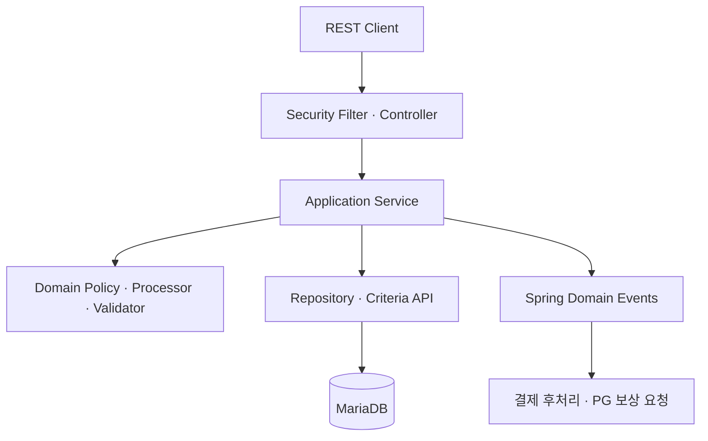
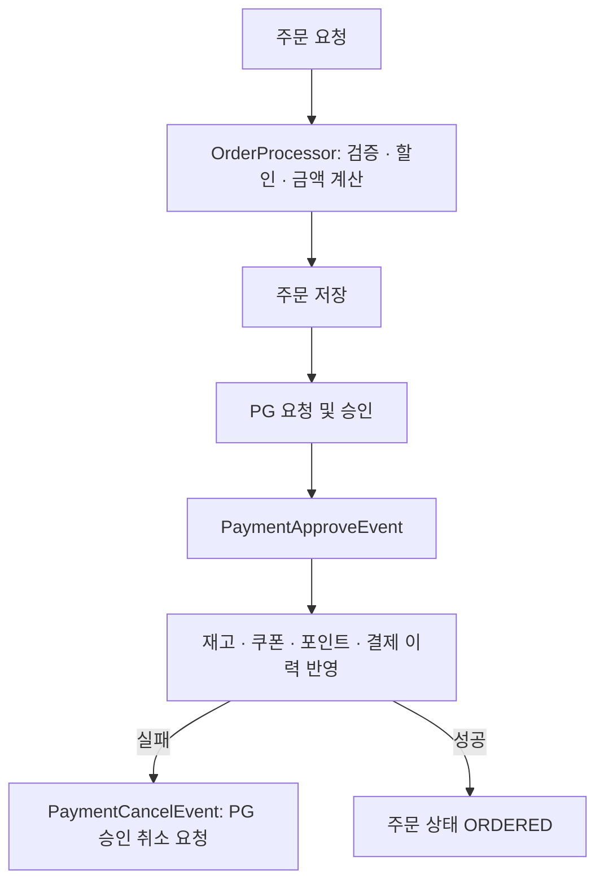

# F&B Commerce Backend API

식음료(F&B) 커머스의 회원, 상품, 장바구니, 주문, 할인, 포인트와 결제 흐름을 다루는 Spring Boot REST API입니다.

단순 CRUD뿐 아니라 주문 생성 과정의 검증·금액 계산을 도메인 객체로 분리하고, 할인·포인트·PG 처리에 전략 및 팩토리 패턴을 적용했습니다. 결제 승인 이후의 재고, 쿠폰, 포인트, 결제 이력 처리는 Spring 애플리케이션 이벤트로 분리하는 구조를 지향합니다.

> 이 저장소는 개발 중인 프로토타입입니다. 실행 전 [현재 상태 및 주의사항](#현재-상태-및-주의사항)을 먼저 확인해 주세요.

## 주요 기능

| 영역 | 구현 내용 |
| --- | --- |
| 인증 | 회원가입, BCrypt 비밀번호 암호화, 로그인 및 JWT 발급, Stateless 인증 필터 |
| 상품 | 상품 목록·상세 조회, 선택 수량 기준 구매 가능 여부 확인 |
| 장바구니 | 상품과 옵션 추가, 회원별 장바구니 조회, 수량 수정, 삭제 |
| 쿠폰 | 사용 가능한 쿠폰 조회, 회원 쿠폰 발급, 상품 적용 가능 여부 확인 |
| 주문 | 회원·상품·옵션·쿠폰·포인트 검증, 할인 계산, 주문 및 주문 상품 생성 |
| 결제 | PG 전략 선택, 카카오페이 요청·승인·취소 처리, 결제 수단별 이력 저장 |
| 결제 후처리 | 재고 차감·복원, 쿠폰 사용·복원, 포인트 적립·복원, 주문 상태 변경 |
| 마이페이지 | 회원 정보와 주문 내역 조회 |
| 리뷰 | 상품별·회원별 리뷰 조회를 위한 Repository와 API 골격 |

## 기술 스택

| 구분 | 기술 |
| --- | --- |
| Language | Java 17 |
| Framework | Spring Boot 3.5.6 |
| Web | Spring MVC, Bean Validation |
| Security | Spring Security, JWT(JJWT 0.11.5), BCrypt |
| Persistence | Spring Data JPA, JPA `EntityManager`, Criteria API |
| Database | MariaDB(MySQL 드라이버도 런타임 의존성에 포함) |
| Event | Spring `ApplicationEventPublisher`, `@TransactionalEventListener` |
| Build | Gradle 8.14.3 Wrapper |
| Utilities | Lombok |

## 아키텍처



### 적용된 설계 요소

- `OrderProcessor`: 주문 구성, 상품·옵션 조합, 쿠폰과 회원 등급 할인 계산을 서비스 오케스트레이션에서 분리합니다.
- `OrderValidator`: 회원 상태, 포인트, 보유 쿠폰, 상품과 옵션의 주문 가능 여부를 검증합니다.
- `DiscountPolicy`: 정액(`AbsoluteDiscount`)과 정률(`RateDiscount`) 할인 전략을 캡슐화합니다.
- `PointPolicy`: 정액(`AbsolutePoint`)과 정률(`RatePoint`) 포인트 정책을 캡슐화합니다.
- `IPay`: 카카오·네이버·토스 결제 전략의 공통 인터페이스를 제공합니다.
- `PayFactory`, `DiscountFactory`, `PointFactory`: 입력 유형에 맞는 정책 구현체를 선택합니다.
- Spring Event: 결제 승인/취소 요청과 후처리를 서비스 사이의 이벤트로 전달합니다.

## 주문·결제 처리 흐름

현재 코드가 지향하는 흐름은 다음과 같습니다.



후처리 단계에서는 상품 재고 차감, 쿠폰 사용 처리, 포인트 반영, `Payment`/`PaymentElement` 저장을 수행합니다. 주문 취소 시에는 반대 방향으로 재고·쿠폰·포인트를 복원하고 취소 이력을 남기도록 구성되어 있습니다.

## 프로젝트 구조

```text
src/main/java/com/fnb/front/backend
├── config/                     # SecurityFilterChain, PasswordEncoder 설정
├── security/                   # JWT 생성·검증, 인증 필터, UserDetails
├── controller/
│   ├── domain/
│   │   ├── event/              # 결제 요청·승인·취소 이벤트
│   │   ├── implement/          # 할인·포인트·결제 정책 인터페이스
│   │   ├── pay/                # PG별 결제 전략
│   │   ├── processor/          # 주문·결제 처리 객체
│   │   ├── request/            # API 요청 모델
│   │   ├── response/           # API 응답 모델
│   │   └── validator/          # 주문 유효성 검사
│   └── dto/                    # 결제 및 주문 내부 전달 객체
├── repository/                 # EntityManager·Criteria API 기반 데이터 접근
├── service/                    # 도메인별 애플리케이션 서비스
└── util/                       # 상태·유형 Enum과 공통 유틸리티
```

## 실행 방법

### 1. 사전 요구 사항

- JDK 17 이상
- MariaDB
- Gradle 배포 파일과 Maven 의존성을 받을 수 있는 네트워크

### 2. 저장소 받기

```bash
git clone https://github.com/leedoohee/fnb-front-backend-api.git
cd fnb-front-backend-api
```

### 3. 데이터베이스 준비

```sql
CREATE DATABASE fnb2
    CHARACTER SET utf8mb4
    COLLATE utf8mb4_unicode_ci;
```

기본 설정은 Hibernate `ddl-auto=update`입니다. 애플리케이션 시작 시 엔티티를 기준으로 스키마를 생성하거나 갱신하지만, 별도의 마이그레이션과 초기 데이터 파일은 제공하지 않습니다.

### 4. 환경 변수 설정

저장소에 실제 비밀번호나 서명 키를 추가하지 말고 환경 변수로 전달해 주세요.

macOS/Linux:

```bash
export SPRING_DATASOURCE_URL='jdbc:mariadb://localhost:3306/fnb2?serverTimezone=UTC&characterEncoding=UTF-8'
export SPRING_DATASOURCE_USERNAME='root'
export SPRING_DATASOURCE_PASSWORD='your-password'
export JWT_SECRET="$(openssl rand -base64 32)"
export JWT_EXPIRATION_TIME='86400'
```

Windows PowerShell:

```powershell
$env:SPRING_DATASOURCE_URL = 'jdbc:mariadb://localhost:3306/fnb2?serverTimezone=UTC&characterEncoding=UTF-8'
$env:SPRING_DATASOURCE_USERNAME = 'root'
$env:SPRING_DATASOURCE_PASSWORD = 'your-password'
$env:JWT_SECRET = '<Base64로 인코딩한 256비트 이상의 키>'
$env:JWT_EXPIRATION_TIME = '86400'
```

`JWT_SECRET`은 Base64 형식의 충분히 긴 키여야 합니다. 현재 `JwtUtil`은 `JWT_EXPIRATION_TIME`을 **초 단위**로 해석하므로 `86400`은 24시간입니다.

### 5. 애플리케이션 실행

macOS/Linux:

```bash
bash gradlew bootRun
```

Windows:

```bat
gradlew.bat bootRun
```

기본 주소는 `http://localhost:8080`입니다.


## 인증 사용법

`/auth/sign-in`, `/auth/sign-up`을 제외한 모든 API는 다음 헤더가 필요합니다.

```http
Authorization: Bearer <access-token>
```

### 회원가입

```bash
curl -X POST 'http://localhost:8080/auth/sign-up' \
  -H 'Content-Type: application/json' \
  -d '{
    "memberId": "demo-user",
    "name": "Demo User",
    "password": "change-me",
    "email": "demo@example.com",
    "phone": "010-0000-0000",
    "address": "Seoul"
  }'
```

### 로그인 및 인증 API 호출

로그인 응답 본문은 JWT 문자열입니다.

```bash
TOKEN=$(curl -s -X POST 'http://localhost:8080/auth/sign-in' \
  -H 'Content-Type: application/json' \
  -d '{"memberId":"demo-user","password":"change-me"}')

curl 'http://localhost:8080/product/list' \
  -H "Authorization: Bearer ${TOKEN}"
```

## API 목록

### 인증

| Method | Endpoint | 인증 | 설명 |
| --- | --- | --- | --- |
| `POST` | `/auth/sign-up` | 불필요 | 회원가입 |
| `POST` | `/auth/sign-in` | 불필요 | 로그인 및 JWT 발급 |

### 상품·장바구니

| Method | Endpoint | 설명 |
| --- | --- | --- |
| `GET` | `/product/list` | 상품 목록 조회 |
| `GET` | `/product/{productId}` | 상품, 옵션, 이미지 상세 조회 |
| `GET` | `/product/validate/{productId}?quantity={quantity}` | 구매 수량 기준 상품 재고 확인 |
| `POST` | `/cart` | 상품과 선택 옵션을 장바구니에 추가 |
| `GET` | `/cart/{memberId}` | 회원 장바구니 조회 |
| `PUT` | `/cart` | 장바구니 상품 수량 수정 |
| `DELETE` | `/cart/{cartId}` | 장바구니 삭제 |

### 쿠폰·주문

| Method | Endpoint | 설명 |
| --- | --- | --- |
| `GET` | `/coupon/list` | 사용 가능한 쿠폰 목록 조회 |
| `POST` | `/coupon/{memberId}/{couponId}` | 회원에게 쿠폰 발급 |
| `POST` | `/coupon/valid-apply/{memberId}/{couponId}?productId={productId}` | 회원 쿠폰의 상품 적용 가능 여부 확인 |
| `POST` | `/order` | 주문 생성 및 결제용 주문 정보 반환 |
| `PUT` | `/cancel-order/{orderId}` | 주문 취소 요청 |

### 결제

| Method | Endpoint | 설명 |
| --- | --- | --- |
| `POST` | `/payment/request` | 선택한 PG 전략으로 결제 요청 |
| `POST` | `/payment/kakao/approve` | 카카오페이 승인 결과 처리 |
| `POST` | `/payment/kakao/cancel` | 카카오페이 취소 결과 처리 |

### 마이페이지·리뷰

| Method | Endpoint | 설명 |
| --- | --- | --- |
| `GET` | `/my-page/info/{memberId}` | 회원 정보·포인트·쿠폰 등 요약 조회 |
| `GET` | `/my-page/order` | 회원 주문 내역 검색 및 페이지 조회 |
| `GET` | `/review/{productId}` | 상품 리뷰 조회(의도된 API) |
| `GET` | `/review/{memberId}` | 회원 작성 리뷰 조회(의도된 API, 위 경로와 충돌) |

인증 API 두 개를 제외한 모든 엔드포인트에는 JWT가 필요합니다.

## 주요 요청 모델

### 주문 생성

```json
{
  "memberId": "demo-user",
  "orderType": 1,
  "point": 1000,
  "orderProductRequests": [
    {
      "productId": 1,
      "productOptionIds": [10, 11],
      "quantity": 2
    }
  ],
  "orderCouponRequests": [
    {
      "productId": 1,
      "couponId": 3
    }
  ]
}
```

### 장바구니 추가

```json
{
  "productId": 1,
  "memberId": "demo-user",
  "quantity": 2,
  "cartItemRequests": [
    {
      "cartId": 0,
      "optionType": "BASIC",
      "optionGroupId": 1,
      "optionId": 10
    }
  ]
}
```

요청 모델의 세부 필드는 `controller/domain/request` 패키지에서 확인할 수 있습니다.

## 핵심 도메인

- 주문: `Order`, `OrderProduct`, `OrderOption`
- 결제: `Payment`, `PaymentElement`, `PaymentCancel`, `PaymentType`
- 상품: `Product`, `ProductOption`, `ProductAttachFile`, `OptionGroup`, `Option`
- 회원: `Member`, `MemberGrade`, `MemberGradeProduct`, `MemberPoint`, `MemberPointRule`
- 쿠폰: `Coupon`, `CouponProduct`, `MemberCoupon`
- 장바구니: `Cart`, `CartItem`
- 리뷰: `Review`, `ReviewAttachFile`

## 현재 상태 및 주의사항

- 카카오페이 전략은 구현 중이며, 네이버페이와 토스페이 전략은 현재 메서드 골격만 존재합니다.
- PG 인증 정보와 콜백/리다이렉트 URL이 외부 설정으로 완전히 분리되지 않았습니다. 실제 연동 전에 환경 변수 또는 Secret Manager로 이동하고 노출된 적이 있는 실제 키는 폐기·재발급해야 합니다.
- 결제 승인·취소 이벤트와 보상 처리의 트랜잭션 경계는 실제 PG 샌드박스를 이용한 통합 검증이 필요합니다.
- 인증된 사용자가 URL의 다른 `memberId`에 접근하지 못하도록 리소스 소유권 검증을 추가해야 합니다. 현재 보안 설정은 인증 여부만 확인합니다.
- 별도의 CORS 설정이 없어 다른 Origin의 프런트엔드와 연동할 때 추가 설정이 필요할 수 있습니다.
- `assert`에 의존하는 검증을 명시적인 예외 처리로 바꾸고, 전역 예외 응답 형식을 정의할 필요가 있습니다.
- Flyway/Liquibase 마이그레이션, 샘플 데이터, 자동화 테스트와 CI 설정은 아직 포함되어 있지 않습니다.

## 권장 개선 순서

1. 리뷰 API 경로 충돌을 해소하고 애플리케이션 컨텍스트 기동 테스트를 추가합니다.
2. 저장소에 포함된 DB·JWT·PG 관련 실제 자격 증명을 모두 교체하고 설정을 외부화합니다.
3. 결제 요청 → 승인 → 후처리 → 실패 보상의 트랜잭션 경계를 통합 테스트로 고정합니다.
4. URL의 `memberId` 대신 인증 주체를 사용하고 역할·소유권 기반 인가를 적용합니다.
5. PG별 요청/응답 DTO를 분리하고 네이버페이·토스페이 전략을 구현합니다.
6. 데이터베이스 마이그레이션과 테스트 데이터를 추가합니다.
