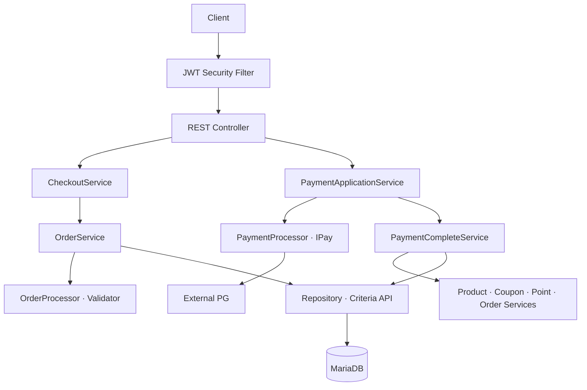
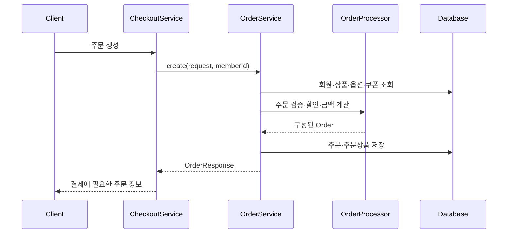
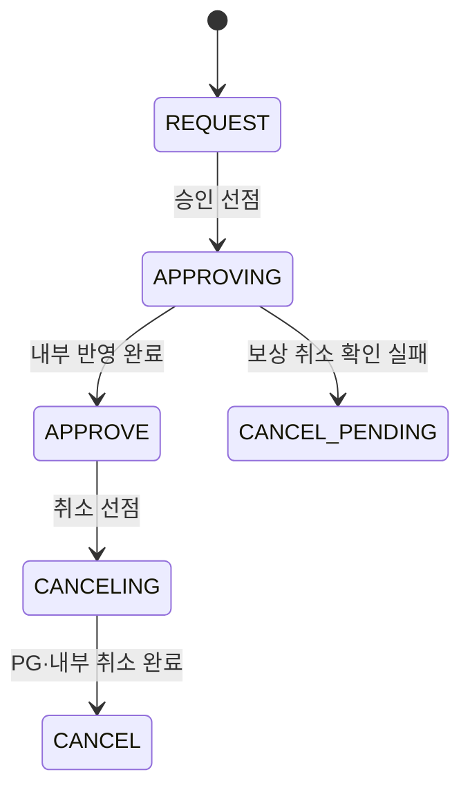

# F&B Commerce Backend API

회원, 상품, 장바구니, 쿠폰, 주문과 결제를 다루는 Spring Boot 기반 F&B 커머스 백엔드입니다.

주문 생성 단계에서 회원·상품·옵션·쿠폰·포인트를 검증하고 서버가 결제 금액을 계산합니다. 외부 PG 승인 이후에는 재고, 쿠폰, 포인트, 주문 상태와 결제 이력을 하나의 로컬 DB 트랜잭션에서 반영하며, 결제 시도와 결제 상태를 조건부 UPDATE로 선점해 중복 처리를 제한하는 방향으로 설계했습니다.

> 현재 저장소는 결제 정합성 설계를 발전시키는 프로토타입입니다. 카카오페이 연동과 상태 전이에 남은 문제가 있어 운영 환경에 바로 사용할 수 없습니다. 실행 전 [현재 상태와 제한사항](#현재-상태와-제한사항)을 확인해 주세요.

## 주요 기능

| 영역 | 구현 내용 |
| --- | --- |
| 인증 | 회원가입, BCrypt 비밀번호 암호화, 로그인, JWT 발급 및 Stateless 인증 |
| 상품 | 상품 목록·상세 조회, 주문 가능 수량 검증 |
| 장바구니 | 회원별 장바구니 추가·조회·수정·삭제 |
| 쿠폰 | 쿠폰 목록 조회, 회원 쿠폰 발급, 상품 적용 가능 여부 검증 |
| 주문 | 회원·상품·옵션·쿠폰·포인트 검증, 할인과 최종 금액 계산, 주문 저장 |
| 체크아웃 | 유상·0원 주문 분기와 결제 유스케이스 연결 |
| 결제 | PG Ready·Approve·Cancel, 결제 시도 저장, 승인 및 취소 상태 선점 |
| 결제 완료 | 재고·쿠폰·포인트·주문·결제 이력을 로컬 트랜잭션으로 반영 |
| 마이페이지 | 회원 정보와 주문 내역 조회 |
| 리뷰 | 상품별·회원별 리뷰 조회 |

## 기술 스택

| 구분 | 기술 |
| --- | --- |
| Language | Java 17 |
| Framework | Spring Boot 3.5.6 |
| Web | Spring MVC, Bean Validation |
| Security | Spring Security, JWT(JJWT 0.11.5), BCrypt |
| Persistence | Spring Data JPA, `EntityManager`, Criteria API |
| Database | MariaDB |
| Build | Gradle 8.14.3 Wrapper |
| Utilities | Lombok |

## 아키텍처



### 책임 구분

- `CheckoutService`: 주문 생성과 0원 결제·일반 결제 흐름을 연결합니다.
- `OrderService`: 주문 생성에 필요한 데이터를 조회하고 저장을 조정합니다.
- `OrderProcessor`: 주문 검증, 옵션 조합, 쿠폰·회원 등급 할인과 주문 상품 구성을 담당합니다.
- `OrderValidator`, `PaymentValidator`: 주문 가능 조건과 결제 금액 정합성을 검사합니다.
- `PaymentApplicationService`: 결제 요청·승인·취소 순서와 PG 보상 처리를 조정합니다.
- `PaymentProcessor`, `IPay`, `PayFactory`: PG 구현체를 선택하고 공통 요청·승인·취소 계약을 제공합니다.
- `KakaoPay`: 카카오페이 HTTP 요청과 카카오 전용 응답을 내부 공통 응답으로 변환합니다.
- `PaymentCompleteService`: PG 통신 이후 내부 재고·쿠폰·포인트·주문·결제 변경을 짧은 DB 트랜잭션으로 처리합니다.

## 인증과 리소스 인가

JWT 필터가 토큰의 회원 ID로 `CustomUserDetails`를 구성합니다. 개인 리소스 API는 클라이언트가 보낸 `memberId` 대신 `@AuthenticationPrincipal`의 `getUserId()`를 사용합니다.

```java
@GetMapping("/cart")
public ResponseEntity<List<CartInfoResponse>> getCart(
        @AuthenticationPrincipal CustomUserDetails user
) {
    return ResponseEntity.ok(
            cartService.getInfo(user.getUserId())
    );
}
```

| 적용 영역 | 소유권 확인 방식 |
| --- | --- |
| 주문 생성 | 인증 회원 ID를 주문 회원으로 사용 |
| 주문 취소 | `orderId + memberId`로 소유 주문 조회 |
| 결제 준비 | `orderId + memberId`로 결제 대상 주문 조회 |
| 장바구니 변경 | `cartId + memberId` 조건으로 수정·삭제 |
| 쿠폰 발급·검증 | 인증 회원 ID 사용 |
| 마이페이지·내 리뷰 | 인증 회원 ID로 조회 |

카카오페이 승인 리다이렉트는 브라우저가 Bearer JWT를 첨부하지 않으므로 별도로 공개합니다. 회원 Principal 대신 충분히 무작위적인 `attemptKey`, 저장된 주문·회원·PG 거래정보와 단일 사용 상태 전이로 검증해야 합니다.

## 주문 처리 흐름



`OrderProcessor`는 요청별 데이터와 `OrderValidator`를 생성자로 받아 사용합니다. 요청 상태를 Spring 싱글톤 필드에 보관하지 않으므로 동시에 들어온 주문 데이터가 서로 덮어쓰는 문제를 피합니다.

### 재고 차감

재고 UPDATE는 상품 ID와 남은 수량 조건을 함께 사용합니다.

```sql
UPDATE product
SET quantity = quantity - :orderQuantity
WHERE product_id = :productId
  AND quantity >= :orderQuantity;
```

동시에 주문이 들어와도 재고가 음수가 되지 않도록 DB가 조건을 원자적으로 검사합니다. 영향 행 수가 `0`이면 결제 완료 트랜잭션을 실패시켜 내부 변경을 롤백합니다.

## 결제 처리 흐름

### 1. 결제 요청

1. 인증 사용자와 주문 소유권을 확인합니다.
2. 주문 상태, 서버 주문 금액과 요청 금액을 비교합니다.
3. 일회용 `attemptKey`를 생성하고 PG Ready API를 호출합니다.
4. PG 거래번호 `tid`, 주문·회원·예상 금액을 `PaymentAttempt`로 저장합니다.
5. 클라이언트에 PG 이동 URL을 반환합니다.

### 2. 카카오페이 승인

1. 공개 리다이렉트 엔드포인트가 `attemptKey`, `pg_token`을 받습니다.
2. 저장된 결제 시도에서 주문과 회원을 복원합니다.
3. `REQUEST → APPROVING` 조건부 UPDATE로 하나의 승인 요청만 선점합니다.
4. 카카오페이 Approve API를 호출하고 승인 금액을 주문 금액과 다시 비교합니다.
5. `PaymentCompleteService`가 재고·쿠폰·포인트·주문·결제 이력을 로컬 트랜잭션으로 반영합니다.
6. 내부 반영에 실패하면 카카오페이 Cancel API로 보상 취소를 시도합니다.

### 3. 주문 취소

1. 인증 사용자와 주문 소유권, 결제 상태를 확인합니다.
2. `APPROVE → CANCELING` 조건부 UPDATE로 중복 취소를 제한합니다.
3. PG 결제가 있으면 Cancel API를 호출하고 동기 응답을 `CancelPaymentResponse`로 변환합니다.
4. 재고·쿠폰·포인트를 복원하고 취소 이력과 결제 요소를 저장합니다.
5. 결제 상태를 `CANCELING → CANCEL`로 변경합니다.

카카오페이 Ready 요청의 `cancel_url`은 승인된 결제의 환불 콜백이 아닙니다. 사용자가 결제 인증을 중단했을 때 이동하는 가맹점 URL이며, 승인된 결제의 취소 결과는 Cancel API의 동기 응답으로 처리하는 구조입니다.

### 목표 상태 전이



조건부 UPDATE는 식별자와 기대 상태를 함께 WHERE 절에 사용하고, 영향 행 수가 1인지 확인하는 방식입니다.

```sql
UPDATE payment_attempt
SET status = 'APPROVING'
WHERE attempt_key = :attemptKey
  AND status = 'REQUEST';
```

## 결제 데이터 모델

| 모델 | 역할 |
| --- | --- |
| `PaymentAttempt` | Ready 단계의 `attemptKey`, `tid`, 주문·회원·예상 금액과 처리 상태 저장 |
| `Payment` | 주문별 최종 결제 금액, 결제 유형과 전체 상태 저장 |
| `PaymentElement` | PG, 쿠폰, 포인트 등 결제 수단별 승인·취소 이력 저장 |
| `PaymentCancel` | 주문·결제 단위 취소 이력 저장 |
| `ApprovePaymentResponse` | PG별 승인 응답을 내부 공통 모델로 변환 |
| `CancelPaymentResponse` | PG별 취소 응답을 내부 공통 모델로 변환 |

`PaymentAttempt.attemptKey`와 PG 거래번호에는 Unique 제약이 있으며, `Payment.orderId`에도 Unique 제약을 두어 주문별 중복 결제 저장을 제한합니다.

## 적용한 설계 요소

- Strategy: `DiscountPolicy`, `PointPolicy`, `IPay`로 할인·포인트·PG 동작의 공통 계약을 정의합니다.
- Factory: `DiscountFactory`, `PointFactory`, `PayFactory`가 입력 유형에 맞는 구현체를 선택합니다.
- Request-scoped processor: `OrderProcessor`가 주문별 데이터를 생성자로 받아 검증과 계산을 캡슐화합니다.
- Application service: `CheckoutService`, `PaymentApplicationService`가 여러 도메인 서비스의 호출 순서를 조정합니다.
- Transactional completion: PG 통신과 내부 DB 트랜잭션을 분리하고 `PaymentCompleteService`가 내부 변경을 원자적으로 처리합니다.
- State compare-and-set: 결제 식별자와 기대 상태를 UPDATE 조건으로 사용해 동시 승인·취소를 선점합니다.
- Resource ownership: URL이나 Body의 회원 ID 대신 인증 회원을 사용하고 Repository 조회 조건에도 소유자를 포함합니다.

## API 개요

`/auth/sign-in`, `/auth/sign-up`, 카카오 승인 리다이렉트를 제외한 API는 JWT 인증이 필요합니다.

```http
Authorization: Bearer <access-token>
```

| Method | Endpoint | 인증 | 설명 |
| --- | --- | --- | --- |
| `POST` | `/auth/sign-up` | 공개 | 회원가입 |
| `POST` | `/auth/sign-in` | 공개 | JWT 발급 |
| `GET` | `/product/list` | JWT | 상품 목록 |
| `GET` | `/product/{productId}` | JWT | 상품 상세 |
| `GET` | `/product/validate/{productId}` | JWT | 주문 가능 수량 확인 |
| `POST` | `/cart` | JWT | 장바구니 추가 |
| `GET` | `/cart` | JWT | 내 장바구니 조회 |
| `PUT` | `/cart` | JWT | 장바구니 수정 |
| `DELETE` | `/cart/{cartId}` | JWT | 장바구니 삭제 |
| `GET` | `/coupon/list` | JWT | 쿠폰 목록 |
| `POST` | `/coupon/{couponId}` | JWT | 회원 쿠폰 발급 |
| `POST` | `/coupon/valid-apply/{couponId}` | JWT | 상품 쿠폰 적용 검증 |
| `POST` | `/order` | JWT | 주문 생성 |
| `PUT` | `/cancel-order/{orderId}` | JWT | 주문·결제 취소 |
| `POST` | `/payment/request` | JWT | PG Ready 요청 |
| `GET` | `/payment/kakao/approve/{attemptKey}` | 공개 | 카카오 인증 완료 리다이렉트 및 승인 |
| `GET` | `/my-page/info` | JWT | 내 정보 |
| `GET` | `/my-page/order` | JWT | 내 주문 목록 |
| `GET` | `/product-review/list` | JWT | 상품 리뷰 목록 |
| `GET` | `/my-review/list` | JWT | 내 리뷰 목록 |

## 프로젝트 구조

```text
src/main/java/com/fnb/front/backend
├── config/                     # SecurityFilterChain, PasswordEncoder
├── security/                   # JWT 생성·검증, 인증 필터, UserDetails
├── controller/                 # REST API
│   ├── domain/
│   │   ├── command/            # 애플리케이션 서비스 명령 모델
│   │   ├── implement/          # 할인·포인트·결제 정책 인터페이스
│   │   ├── pay/                # PG별 구현체
│   │   ├── processor/          # 주문·결제 처리 객체
│   │   ├── request/            # 요청 모델
│   │   ├── response/           # PG 공통·전용 응답 모델
│   │   └── validator/          # 주문·결제 검증
│   └── dto/                    # 외부 API 전송 및 조회 DTO
├── repository/                 # EntityManager·Criteria API 기반 데이터 접근
├── service/                    # 유스케이스 조정과 트랜잭션 경계
└── util/                       # 상태·유형 Enum과 공통 유틸리티
```

## 실행 방법

### 요구 사항

- JDK 17 이상
- MariaDB
- Gradle 배포 파일과 Maven 의존성을 받을 수 있는 네트워크

### 데이터베이스 준비

```sql
CREATE DATABASE fnb2
    CHARACTER SET utf8mb4
    COLLATE utf8mb4_unicode_ci;
```

현재 Hibernate 설정은 `ddl-auto=update`이며 별도 마이그레이션과 초기 데이터는 제공하지 않습니다.

### 환경 변수

Spring Boot의 외부 설정 우선순위를 이용해 저장소의 기본값을 덮어쓸 수 있습니다.

```bash
export SPRING_DATASOURCE_URL='jdbc:mariadb://localhost:3306/fnb2?serverTimezone=UTC&characterEncoding=UTF-8'
export SPRING_DATASOURCE_USERNAME='root'
export SPRING_DATASOURCE_PASSWORD='your-password'
export JWT_SECRET="$(openssl rand -base64 32)"
export JWT_EXPIRATION_TIME='86400'
```

Windows PowerShell:

```powershell
$env:SPRING_DATASOURCE_URL = 'jdbc:mariadb://localhost:3306/fnb2?serverTimezone=UTC&characterEncoding=UTF-8'
$env:SPRING_DATASOURCE_USERNAME = 'root'
$env:SPRING_DATASOURCE_PASSWORD = 'your-password'
$env:JWT_SECRET = '<Base64로 인코딩한 256비트 이상의 키>'
$env:JWT_EXPIRATION_TIME = '86400'
```

`JwtUtil`은 `JWT_EXPIRATION_TIME`을 초 단위로 해석합니다. 예시의 `86400`은 24시간입니다.

카카오페이 Secret Key와 Ready·Approve·Cancel URL은 현재 `KakaoPay`에 상수로 선언되어 있습니다. 실제 연동 전 설정 프로퍼티로 외부화해야 합니다.

### 실행

```bash
git clone https://github.com/leedoohee/fnb-front-backend-api.git
cd fnb-front-backend-api
./gradlew bootRun
```

Windows:

```bat
gradlew.bat bootRun
```

기본 주소는 `http://localhost:8080`입니다.

### 테스트

```bash
./gradlew test
```

현재 `src/test` 테스트 코드는 없습니다. 결제 상태 전이와 보상 처리에 대한 자동화 테스트 추가가 필요합니다.

## 요청 예시

### 회원가입

```bash
curl -X POST 'http://localhost:8080/auth/sign-up' \
  -H 'Content-Type: application/json' \
  -d '{
    "memberId": "demo-user",
    "name": "Demo User",
    "password": "change-me",
    "email": "demo@example.com",
    "phone": "010-0000-0000",
    "address": "Seoul"
  }'
```

### 인증 API 호출

```bash
TOKEN=$(curl -s -X POST 'http://localhost:8080/auth/sign-in' \
  -H 'Content-Type: application/json' \
  -d '{"memberId":"demo-user","password":"change-me"}')

curl 'http://localhost:8080/cart' \
  -H "Authorization: Bearer ${TOKEN}"
```

### 주문 생성

`memberId`는 JWT 인증 주체에서 가져오므로 Body에 포함하지 않습니다.

```json
{
  "orderType": 1,
  "point": 1000,
  "orderProductRequests": [
    {
      "productId": 1,
      "productOptionIds": [10, 11],
      "quantity": 2
    }
  ],
  "orderCouponRequests": [
    {
      "productId": 1,
      "couponId": 3
    }
  ]
}
```

## 현재 상태와 제한사항

### 높은 우선순위

1. **카카오 Ready 리다이렉트 URL이 실제 서비스 URL을 가리키지 않습니다.** `approval_url`은 현재 카카오 Approve API 주소를, `cancel_url`은 카카오 Cancel API 주소를 사용합니다. 두 값은 각각 가맹점의 승인 리다이렉트와 인증 취소 페이지여야 합니다. `fail_url`도 가맹점 실패 페이지로 변경해야 합니다.
2. **카카오 취소 응답 매핑이 실제 필드와 완전히 일치하지 않습니다.** `approved_cancel_amount`, `canceled_amount`, `cancel_available_amount`, `canceled_at`을 구분해 매핑해야 하며, 부분 취소에서는 원결제 금액이 아니라 이번 취소 승인 금액을 저장해야 합니다.
3. **PG 식별자가 단계마다 다릅니다.** Ready는 요청의 `paymentKey`, Approve는 `attempt.payType`, Cancel은 하드코딩된 `"kakao"`를 CID로 사용합니다. Ready에서 실제 사용한 CID를 결제 시도에 저장하고 모든 단계에서 동일하게 사용해야 합니다.

### 복구·운영 보강

- PG 취소 통신이 예외로 끝나면 `Payment`가 `CANCELING`에 남을 수 있습니다. `CANCEL_PENDING` 작업을 영속화하고 스케줄러·메시지 큐·정산 배치로 재처리해야 합니다.
- PG 타임아웃은 성공과 실패를 확정할 수 없는 결과입니다. `APPROVE_UNKNOWN` 같은 상태와 거래 조회·대사 절차가 필요합니다.
- `assert`는 일반 운영 JVM에서 기본적으로 비활성화되므로 상품·쿠폰·사용자 검증에 사용하면 안 됩니다. 명시적인 도메인 예외로 교체해야 합니다.
- VAT 계산은 과세·비과세 정책을 모델링하지 않고 `총액 ÷ 1.1`을 사용합니다. 공급가액과 부가세를 구분해 서버가 다시 계산해야 합니다.
- `application.properties`의 DB 비밀번호와 JWT 키, `KakaoPay`의 Secret Key를 환경 변수나 Secret Manager로 외부화하고 기존 값은 폐기해야 합니다.
- 카카오 카드 정보가 없는 결제수단에서는 `cardInfo`가 `null`일 수 있으므로 조건부 매핑이 필요합니다.
- 네이버페이와 토스페이 구현체는 현재 스텁이며 `null`을 반환합니다.
- 도메인 예외와 전역 예외 응답(`@RestControllerAdvice`)이 없어 대부분의 실패가 일반 `RuntimeException`으로 노출됩니다.
- Flyway/Liquibase 마이그레이션, 자동화 테스트, CI, 관측성 지표와 구조화 로그가 없습니다.

## 우선 개발 순서

1. 카카오 Ready 리다이렉트 URL과 CID 저장 구조 수정
2. `PaymentAttempt` 승인 완료 상태 전이 및 영향 행 수 검증
3. 승인 결과 불명·보상 취소 실패 상태와 영속 재시도 구현
4. 카카오 취소 응답의 현재·누적·잔여 금액 매핑 완성
5. 0원 결제 모델과 VAT 계산 재정의
6. 승인 중복, DB 롤백, PG 타임아웃, 취소 재시도 통합 테스트 추가
7. Secret 외부화, DB 마이그레이션과 CI 구성

## 설계 의도

이 프로젝트의 핵심 목표는 단순히 PG API를 호출하는 것이 아니라 다음 경계에서 데이터 정합성을 유지하는 것입니다.

- 프론트 요청 금액과 서버 주문 금액
- PG 승인 결과와 서버 주문 금액
- 외부 PG 처리와 내부 DB 트랜잭션
- 동시 승인·취소 요청과 상태 전이
- PG 보상 취소 실패와 사후 복구

외부 HTTP 호출을 장시간 DB 트랜잭션에 포함하지 않고, 짧은 로컬 트랜잭션과 상태 머신·보상 처리·재시도를 조합하는 방향으로 발전시키고 있습니다.
